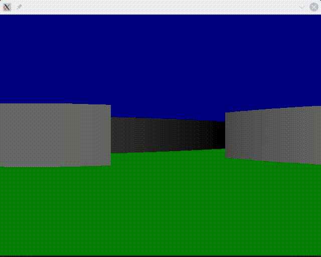
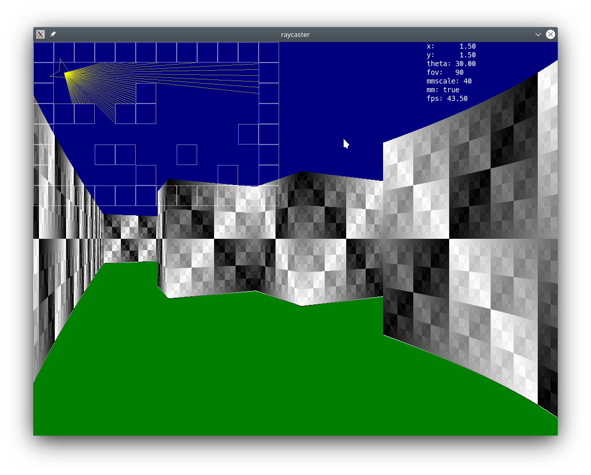

# raycaster

Raycaster in C by David Quarel, Jon Connor





# Dependencies
```
Ubuntu:
	sudo apt-get install make gcc libsdl2-dev libsdl2-ttf-dev libsdl2-image-dev
Arch:
	pacman -S sdl2 sdl2_gfx sdl2_ttf sdl2_image 
```

# How to run
Compile with `make`, then run `./bin/ray`.

# How to play
* W - Move Forward
* S - Move backward
* A - Strafe left
* D - Strafe right
* LEFT - Rotate left
* RIGHT - Rotate right
* Q - decrease FOV
* E - increase FOV
* M - toggle minimap
* K - increase minimap size
* L - decrease minimap size
* P - toggle show game status
* KEYPAD_8 - move minimap up
* KEYPAD_5 - move minimap down
* KEYPAD_4 - move minimap left
* KEYPAD_6 - move minimap right

# TODO Now
* ~~Algorithm to cast rays is inefficient, and takes little 0.01 steps
forward till it hits a wall. Use Bresenhams line algorithm and some
maths to make it fast.~~ DONE
* ~~New faster raycasting algorithm seems to still have some minor
distortion after correcting for fisheye effect. Investigate cause and fix.~~ DONE, cause was
that the angle between each ray cast needs to be chosen such that ray hits are spaced equally
apart on a wall perpendicular to the direction the player is viewing, not just spacing the
angle of the rays equally (as otherwise many rays are cast close to straight ahead, and
few rays are cast in the peripherals).
* Replace the above distortion correction with a lookup table. No sense redoing work.
* Make movement adjust player acceleration rather than velocity, and add friction
 so player movement feels more natural as compared to abrupt movement.
* ~~Game only updates where you hit WASD or LEFT/RIGHT. Eventually want
it to run at 30/60fps, and you hold WASD to constantly move in that direction.~~
DONE
* Add mouselook.
* ~~Learn how to and then implement texture mapping.~~ ~~Grey walls are boring~~ ~~Stripey
walls are less boring.~~ ~~Done, but it needs to be more efficient.~~ DONE, but most of the code time is on SDL stuff. 
Work out why and make it run faster,
* ~~Don't draw walls outside view area.~~ Done? ~~Needs to be verified.~~ DONE
* ~~Add the ability for the minimap to draw the rays that have been cast~~ DONE
* ~~Add collisions with walls~~ DONE 
* ~~Add collisions with the new polygonal walls.~~ DONE, slide along walls using vector projection.
Only works well for convex polygons, as it's possible to walk through corners with reflex angles.
Work out why, and fix it.
* Change the format for texture mapping rather than reinventing the wheel. Work out why some textures
have pink/green static.
* Change the format of the map to have different kinds of walls that are
texture mapped in different ways.
* ~~Adjust collision behaviour so you walk along a wall rather than
stopping immediately when you touch a wall.~~ DONE, but can walk throguh reflex angles for polygon walls.
* ~~Replace a boring grid of squares with walls that can be arbitrary polygons.~~ DONE, but it's inefficient,
and each ray checks for collision with every edge of every polygon.
* Profiling the code, most time is wasted on calls to SDL. Investigate why and fix.

# TODO Someday
* Partition the map with quadtrees or some other clever data structure to make
ray-polygon intersections faster to compute. Could place circles around groups of nearby polygons,
and check circle-ray intersection, which is cheap and easy, by using a perpindicular line that
intersects the center of the circle.
* Add something for the player to interact with (items, monsters)
* Texture map the sky and the floor.
* Make some interesting maps, refactor to allow different levels to
be loaded from a file.
* Add some music/SFX from open domain material.
* Work out how to load lots of textures sensibly as .pngs
* Add support for sprites to draw the player and things in the world.
* Add multiplayer mode (split screen? multiple SDL windows?)
* Add network support for multiplayer over LAN
